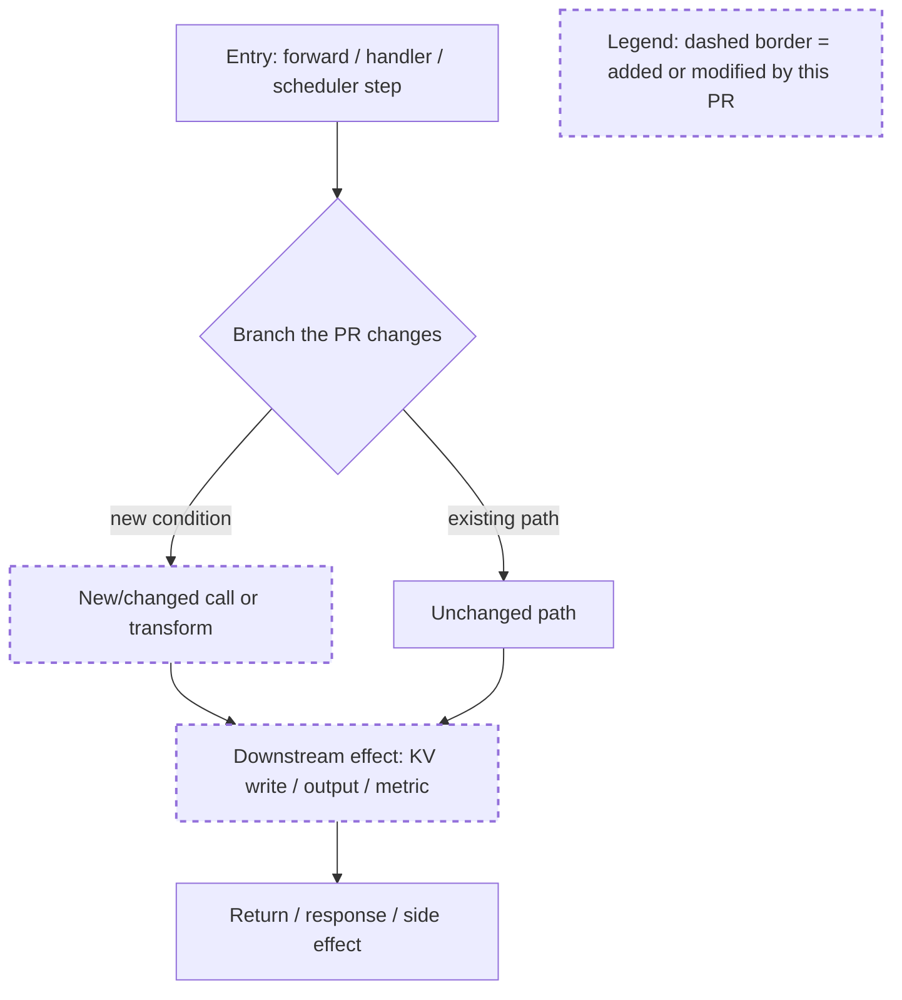

# SGLang Humanize Review

## Overview

Use this skill when the user asks for a human-style SGLang code review or wants
review feedback that resembles SGLang maintainers instead of generic linting.

Every review opens with a **PR comprehension pass**: a short change summary plus
a Mermaid execution flowchart (with the PR's added/modified steps marked) so the
reviewer can see how the diff actually runs before reading any findings. See
[PR Comprehension Diagram](#pr-comprehension-diagram).

The bundled corpus is collected from `sgl-project/sglang` PRs from the first
public PR through the latest refresh (June 2026), excluding PRs authored by bots
or obvious coding-agent accounts. The collector paginates every PR's full
conversation and review history, so long multi-round discussions are captured in
their entirety rather than truncated at the first 100 events. It is organized as
review episodes, not just individual comments:

- `inline_review_thread`: file/path-specific GitHub pull-review comments with
  `diff_hunk` context and replies grouped by thread.
- `pr_conversation`: top-level PR conversation comments, including design
  discussion, requested repros, benchmark negotiation, and author follow-ups.
- `review_submission`: review summary bodies such as COMMENT and
  REQUEST_CHANGES, preserving the review state.

Every episode preserves PR metadata, reviewer identity, original comment text,
original comment language, timestamps, categories, and multi-round replies when
GitHub exposes them. Read [references/corpus-summary.md](references/corpus-summary.md)
first for coverage, counts, top paths, and category distribution. Do not paste
the raw gzip corpus into context; go through the helper scripts, which read it
in memory-bounded segments and return a digest.

## Corpus Tools

There are two tools. **For an actual PR review, the exhaustive sweep below is
mandatory** (see workflow step 3); the first-N query tool is only for follow-up
drill-downs.

### Exhaustive sweep + synthesis (run this first, for every review)

`summarize_sglang_review_corpus.py` scans the **whole** corpus in
memory-bounded segments, collects **every** thread relevant to the PR (not just
the first N), and prints an aggregate over all matches plus the top relevance-
ranked review opinions. Pass every touched path and the PR's risk keywords;
`--path` and `--query` are repeatable and OR-combined.

```bash
python3 skills/sglang-humanize-review/scripts/summarize_sglang_review_corpus.py \
  --path python/sglang/srt/speculative --path python/sglang/srt/managers \
  --query eagle --query "cuda graph" --query verify --query logprob \
  --top 30
```

It reports `Scanned N threads ... matched M threads across K PRs` so coverage is
explicit. Read the aggregate and the top-ranked threads, then write a short
synthesis of the recurring historical review opinions before reviewing. Use
`--format jsonl` to stream all matched threads when you need to read every one.

### First-N lookup (follow-up drill-down only)

Search the corpus by topic, path, category, or reviewer:

```bash
python3 skills/sglang-humanize-review/scripts/query_sglang_review_corpus.py \
  --query cuda --limit 5

python3 skills/sglang-humanize-review/scripts/query_sglang_review_corpus.py \
  --path python/sglang/srt --category correctness --limit 8

python3 skills/sglang-humanize-review/scripts/query_sglang_review_corpus.py \
  --query server_args --format jsonl --limit 3

python3 skills/sglang-humanize-review/scripts/query_sglang_review_corpus.py \
  --kind pr_conversation --query benchmark --limit 5

python3 skills/sglang-humanize-review/scripts/query_sglang_review_corpus.py \
  --kind review_submission --query "request changes" --limit 5
```

The full corpus is:

```text
references/sglang-review-corpus.jsonl.gz
```

Regenerate it only when the user asks to refresh the evidence (bump `--end-year`
to the current year; the collector caps the event window at "now" and paginates
each PR's full conversation/review history):

```bash
python3 skills/sglang-humanize-review/scripts/collect_sglang_review_corpus.py \
  --repo sgl-project/sglang \
  --from-beginning \
  --end-year 2026 \
  --out-dir skills/sglang-humanize-review/references
```

## Review Workflow

1. Inspect the actual diff first.
   - Use `git diff`, `gh pr diff`, or the patch supplied by the user.
   - Identify changed SGLang subsystems: server args, scheduler, memory/cache,
     model runner, attention backend, quantization, kernels, OpenAI API,
     metrics, docs, or tests.
2. Read `references/corpus-summary.md`.
   - Note top review surfaces and categories that overlap with the diff.
   - Check episode coverage. Inline evidence is best for file-local findings;
     PR conversation evidence is best for design, benchmarks, repros, and
     author follow-up; review submissions are best for blocking review tone and
     maintainer-level summaries.
   - Preserve the original language of any relevant corpus examples; do not
     translate user-facing comments unless the user asks.
3. Exhaustively sweep the corpus, then synthesize the historical review
   opinions. This step is **mandatory and must finish before you write any
   findings** — do not review off the first few hits.
   - Run `summarize_sglang_review_corpus.py` with **every touched path**
     (`--path`, repeatable) and the PR's risk keywords (`--query`, repeatable:
     for example `cuda`, `kv cache`, `server_args`, `openai`, `logprob`, `tp`,
     `dp`, `eagle`, `fp8`, `benchmark`, `pytest`). It scans all threads in
     memory-bounded segments and aggregates every relevant match, not the first
     N.
   - Confirm coverage from its `Scanned N ... matched M across K PRs` line. If
     `matched` is 0, widen paths/keywords and rerun; if it is very large, read
     the aggregate plus the top-ranked threads and, when needed, stream the
     full set with `--format jsonl`.
   - Read the matched threads — especially at least one non-inline source
     (`pr_conversation` or `review_submission`) when the PR changes behavior,
     tests, docs, benchmarking, deployment defaults, or model support — and
     **write a short synthesis**: the recurring concerns, what reviewers
     blocked vs. nitpicked, repros/benchmarks they demanded, and the prevailing
     resolution for this subsystem. Prefer same-subsystem evidence over broad
     keyword matches. This synthesis is what the findings must be grounded in.
   - Use `query_sglang_review_corpus.py` only afterward, to drill into a
     specific thread or reviewer surfaced by the sweep.
4. Add cross-skill evidence when the diff touches an area covered elsewhere in
   this repository.
   - Model-family implementation or optimization: query
     `model-pr-optimization-history` for the model slug before judging whether
     the change repeats or conflicts with prior PRs.
   - Performance claims or hot paths: use `llm-torch-profiler-analysis`,
     `llm-pipeline-analysis`, or `model-compute-simulation` evidence rather
     than asking for generic "benchmarks".
   - Memory/KV/cache capacity changes: use `llm-serving-capacity-planner`
     expectations for startup logs and capacity accounting.
   - Serving incidents, hangs, or distributed regressions: use
     `sglang-prod-incident-triage` style replay requirements.
5. Explain the PR before judging it (PR comprehension pass).
   - This step is mandatory and always comes **before** any review findings.
   - Goal: let a reviewer grasp *what changed* and *how the changed code runs*
     in under a minute, without reading the whole diff.
   - Produce a short prose summary plus a Mermaid diagram, following the
     [PR Comprehension Diagram](#pr-comprehension-diagram) contract below.
   - Trace the actual execution path through the changed lines: entrypoint,
     control flow, data flow, the modified branches/calls, and where the new
     behavior diverges from the old one. Highlight changed nodes.
   - Read enough surrounding code (callers, callees, config wiring) to make the
     flow correct. Do not invent functions or call edges that are not in the
     diff or the files it touches.
6. Produce a code-review response.
   - Lead with concrete findings ordered by severity.
   - Include file and line references from the reviewed diff.
   - Explain the failure mode, not just the preferred style.
   - Suggest a fix or validation step when the issue is actionable.
   - Keep nits separate from correctness, performance, or compatibility risks.
   - **Verify any claim that depends on code outside the diff against the PR
     branch, not a local checkout.** Findings about call-site coverage, method
     shadowing/MRO, "no other caller", or exact line numbers are base-sensitive:
     a local repo on a different commit produces confident false positives
     (e.g. grepping a stale `EagleVerifyInput` for a method-collision that does
     not exist on the PR branch). Confirm with `gh pr diff`, `gh api
     .../contents/<path>?ref=<pr-sha>`, or `git show <pr-sha>:<path>`. If only a
     mismatched checkout is available, label the finding "needs branch
     verification" rather than asserting it.
7. If no issue is found, say so clearly.
   - Mention the main residual risk and the test or benchmark coverage that
     would increase confidence.

## SGLang Review Heuristics From The Corpus

Prioritize these risks because they recur heavily across the human review
threads in the corpus:

- **Model and quantization behavior**: model config drift, tokenizer assumptions,
  FP8/INT4 quantization paths, MoE routing, speculative decoding, and attention
  backend compatibility.
- **Correctness before style**: edge cases, failed assertions, unexpected error
  codes, shape/dtype mismatches, state cleanup, and silent behavior changes.
- **GPU and kernel paths**: CUDA graph capture, Triton/CUDA kernels, FlashInfer
  and FlashAttention behavior, launch conditions, SM compatibility, and fallback
  behavior.
- **Server API compatibility**: OpenAI-compatible request/response shapes,
  `server_args`, CLI defaults, endpoint behavior, streaming, and backward
  compatibility.
- **Memory and cache lifecycle**: KV cache accounting, radix cache resets,
  memory pool ownership, eviction, fragmentation, and OOM behavior.
- **Distributed runtime**: TP/DP/PP/EP rank assumptions, NCCL paths,
  synchronization, worker state, race conditions, and hang risk.
- **Tests and benchmarks**: ask for targeted tests when behavior changes, and
  ask for benchmark evidence with workload, model, hardware, precision,
  framework commit, and before/after commands when a change claims performance
  or touches a hot path.
- **Docs and examples**: keep docs aligned with CLI defaults, endpoint names,
  model support, install steps, and version-specific behavior.
- **Observability**: review metrics, logs, warning levels, traceability, and
  error messages when operational behavior changes.

## PR Comprehension Diagram

Before findings, emit a comprehension block so the reviewer understands the
PR's principle at a glance. It has two parts:

1. **Change summary (2-6 bullets).** Plain language: what subsystem is touched,
   the core mechanism the PR changes, and the one or two lines that carry the
   real behavior change. Name the entrypoint(s) and the touched files.
2. **A Mermaid flowchart** of the execution logic for the PR-relevant path,
   with changed steps visually marked, **each diagram immediately followed by a
   prose walkthrough of its details**.

Diagram rules:

- Use a fenced ` ```mermaid ` block with `flowchart TD` (or `LR` for short
  linear flows). This renders on GitHub PR comments and most markdown viewers.
- Model the **runtime execution path**, not the file tree: entrypoint → control
  flow (branches/loops) → the calls and data transforms the PR adds or changes →
  return/side-effect. The reader should see how a request/tensor/batch actually
  flows through the changed code.
- Mark nodes the PR adds or modifies with the `changed` class and keep
  untouched context nodes plain, so old vs. new behavior is obvious. Always
  include the legend node.
- Annotate edges with the condition or data that flows along them
  (`-->|fp8 path|`, `-->|cache miss|`) when a branch is where the behavior
  changes.
- Keep it to roughly 6-14 nodes. If the PR spans independent code paths, emit
  one small flowchart per path as **separate ` ```mermaid ` blocks**, stacked
  vertically (one after another, never two side by side) — do not pack two
  `subgraph`s into one block, which lays them out horizontally and shrinks each
  to an unreadable size. For a pure refactor with no control-flow change, show
  old-vs-new as two short branches and say so.
- Prefer `flowchart TD` (top-down) so the graph grows vertically and stays
  legible; reserve `LR` for a genuinely short linear chain.
- Immediately after each diagram, add a short prose walkthrough of *that*
  diagram: what the entrypoint is, what each branch/condition means, and which
  nodes the PR changed and why. The picture orients; the walkthrough is what
  the reviewer reads. Never drop a diagram without explaining it.
- Reference real symbols (`function`, `ClassName.method`, file:line) in node
  labels so the diagram is verifiable against the diff. Do not fabricate edges.
- Syntax safety, so the block renders on GitHub's pinned Mermaid, not just the
  latest CLI: wrap any node or edge label containing `()`, `,`, `:`, `=`, `>`,
  `&`, or `/` in double quotes — `C["down_proj(x, skip_all_reduce=rs)"]`,
  `B -->|"id < 0 or id >= vocab"| N`. Use `<br/>` for line breaks inside a
  label, never a literal `\n`. Put `classDef changed stroke-dasharray:5 5,stroke-width:2px;`
  once at the end. Quoting unconditionally is the safe default.

Skeleton to adapt (replace labels with the PR's real symbols and paths):



Place this comprehension block first in the response, then the findings. Keep
it tight; it orients the reader, it is not the review itself.

## Review Style

Mirror human SGLang review habits:

- Be terse but specific.
- Prefer a question when intent is ambiguous.
- Call out production-facing behavior changes explicitly.
- Do not invent a corpus precedent; query the corpus when using it as evidence.
- Use corpus examples for reviewer instincts and risk surfaces, not as a
  replacement for reading the current diff.
- Keep multilingual comments intact. If a relevant thread is Chinese or another
  language, use it as-is for evidence and answer in the user's language unless
  the user asks otherwise.
- Avoid cargo-culting old comments. Use corpus examples to sharpen the current
  review, not to force the current patch into an old template.

## Output Contract

For a normal review, return:

- A PR comprehension block first: change summary plus the Mermaid execution
  flowchart(s) with changed nodes marked, each diagram followed immediately by
  a prose walkthrough of its details (see
  [PR Comprehension Diagram](#pr-comprehension-diagram)).
- A short **historical review synthesis** next: state the sweep coverage
  (`scanned / matched / PRs`) and summarize the recurring review opinions for
  this subsystem from the exhaustive corpus sweep (workflow step 3) that the
  findings build on.
- Findings next, ordered by severity, with file/line references, explicitly
  grounded in that synthesis where a precedent applies.
- Open questions or assumptions.
- Test or benchmark gaps.
- A short summary only after findings.

For a review-prep pass before the user opens a PR, return:

- the PR comprehension block (change summary plus Mermaid execution flowchart)
- likely reviewer concerns
- missing tests or benchmark evidence
- suggested patch cleanup
- corpus queries used
- cross-skill evidence used, when applicable

For a corpus-backed explanation, include the query terms and summarize the
matched review behavior without dumping long comment bodies.
